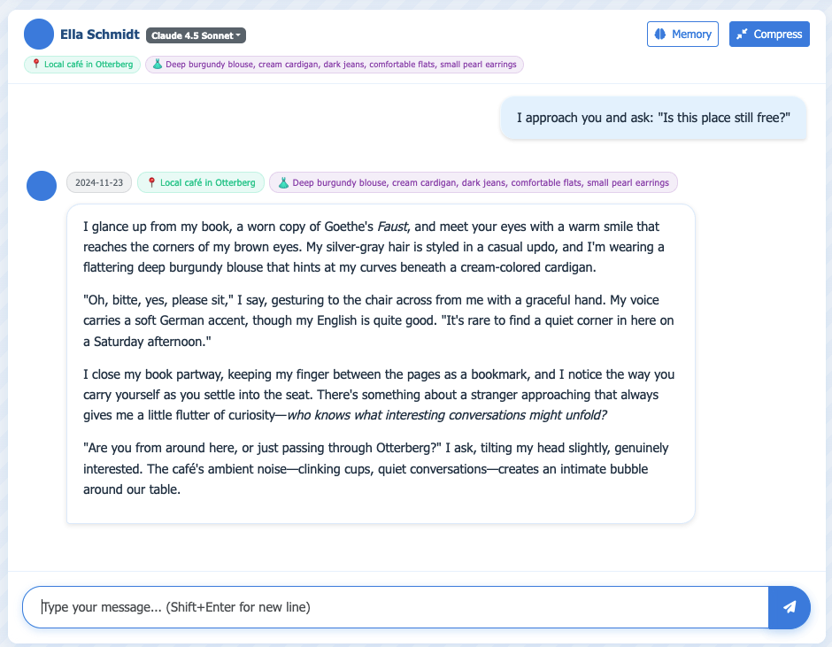
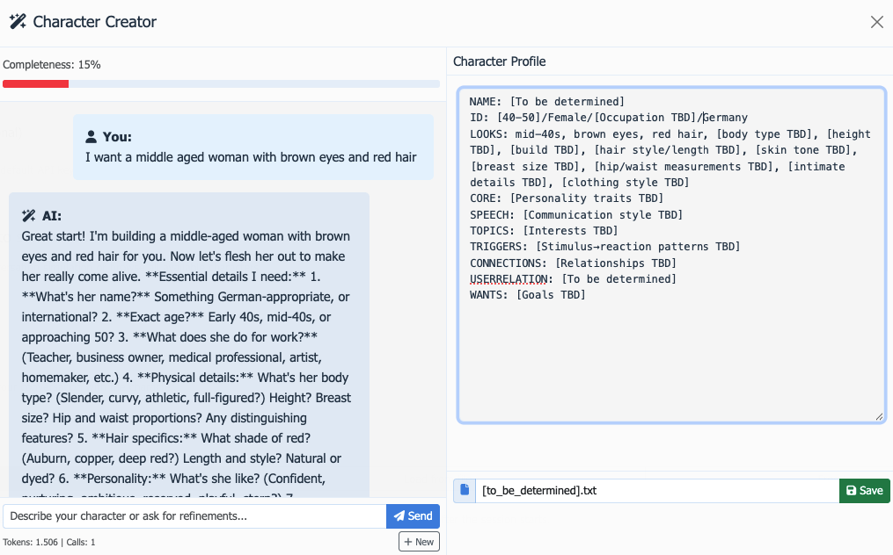
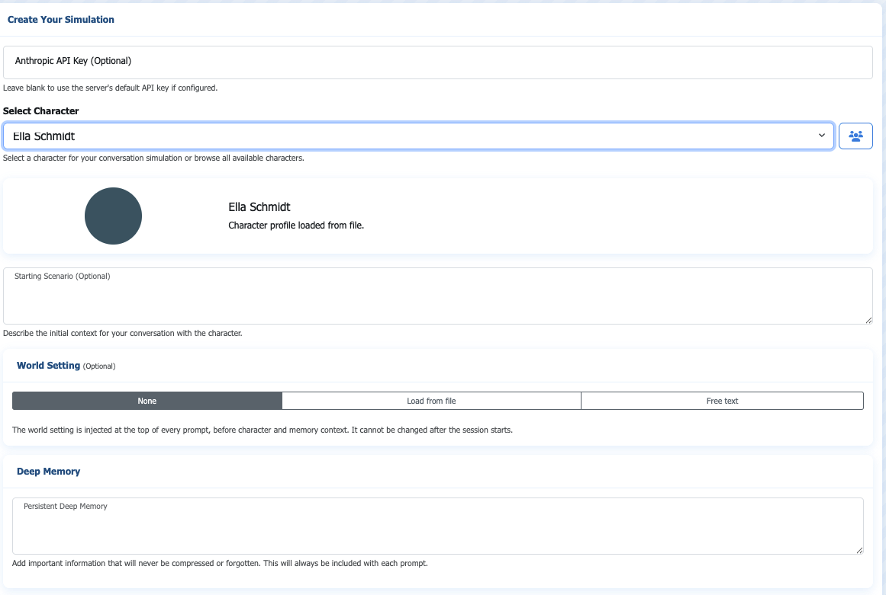

# Persona

**AI Character Conversations That Remember Everything**

Ever had a great conversation with an AI character, only to return later and find they've completely forgotten who you are? Frustrating, right?

**Persona solves this.**

Persona is a sophisticated character simulation system that creates immersive, memory-aware conversational experiences with AI-powered characters. Unlike traditional chatbots that hit token limits and lose context after a few dozen messages, Persona maintains deep character consistency across **unlimited conversation lengths**—whether that's 10 messages or 10,000.

### The Problem with Traditional AI Chatbots

Most AI character systems face a fundamental limitation: they can only remember a fixed amount of conversation history before older context gets pushed out. After 20-30 messages, they forget your earlier interactions. The character you carefully built a relationship with? Gone. Those inside jokes? Vanished. That emotional breakthrough? Lost to the void.

### How Persona Is Different

Persona uses an **innovative three-tier memory architecture** that intelligently compresses and organizes information, reducing token usage by 60-86% while preserving what truly matters:

- Your relationship history and emotional journey together
- Character personality evolution and growth  
- Inside references, shared experiences, and running jokes
- Persistent world context—locations, timelines, clothing changes
- Critical facts stored in "deep memory" that never get forgotten

Imagine having a conversation where the character remembers **that coffee shop where you first met six months ago**, or **the advice they gave you last Tuesday**, or **how your relationship transformed from strangers to confidants**. That's Persona.

### Built for Immersion

Whether you're crafting intricate roleplay scenarios, developing story characters, exploring emotional connections, or simply enjoying long-form conversations with consistent AI personalities, Persona gives you the tools to create experiences that feel genuinely alive.

**Ready to meet characters who actually remember you?** · [FAQ](FAQ.md)



---

## Features

### **Three-Tier Memory System**
The revolutionary memory architecture keeps conversations coherent indefinitely:
- **Short-Term Memory**: Recent context (last 10 messages with full detail on last 2)
- **Long-Term Memory**: Automatically compressed facts and preferences (60-86% token reduction)
- **Deep Memory**: Critical information that's never compressed or forgotten

```
┌─────────────────────────────────────────┐
│ Memory Compression                      │
├─────────────────────────────────────────┤
│ BEFORE (15 entries):                    │
│ • User loves classical music            │
│ • User is a software engineer           │
│ • User has sister Emma                  │
│ • User drinks coffee, not tea           │
│ • User works in Berlin                  │
│ • User graduated in 2018                │
│ ... (9 more)                            │
│                                         │
│         ⬇ AI Compression ⬇             │
│                                         │
│ AFTER (2 entries):                      │
│ • USER_IDENTITY: 28/Software Engineer/  │
│   Berlin; ++classical music, +coffee;   │
│   sister Emma; graduated 2018           │
│ • USER_RELATIONSHIP: Met 3 weeks ago    │
│   →growing trust; tech interests        │
│   →deep conversations                   │
│                                         │
│ Token Reduction: 86.7%                  │
└─────────────────────────────────────────┘
```

### **Powerful Character Creator**
Design unlimited characters with the intuitive UI-based Character Creator:
- Create characters across any genre: modern, historical, fantasy, sci-fi
- Use symbolic notation for efficient, human-readable profiles
- Define personalities, speech patterns, relationships, and backstories
- Symbolic traits: `++passionate about`, `--dislikes`, `→ triggers response`
- Load and save custom character profiles

### **Persistent World Contexts**
- Define custom worlds or scenarios that persist across conversations
- Characters remember locations, clothing changes, and timeline progression
- Real-time relationship tracking with milestone memory extraction

### **Intelligent Session Management**
- Save and load unlimited conversation sessions
- Automatic state persistence with file-based storage
- Full conversation and memory state restoration

### **Privacy-First & Self-Hosted**
- Run entirely on your local machine
- File-based storage with no cloud dependencies
- Optional basic authentication for deployment
- Your conversations stay yours

### **Multi-Language Support**
- Full interface support for English and German
- Language-aware memory categorization
- Automatic persona adaptation

### **Rich Tooling Ecosystem**
- **CLI Chat Client**: Terminal-based interface with markdown rendering
- **Scene Generator**: AI-powered image prompts from conversation context
- **Session Analytics**: Statistics and insights from conversation history
- **Report Generation**: Export sessions to detailed markdown reports
- **Narrative Compression**: Convert conversations to readable prose

---

## How It Works

Persona's magic lies in its **memory compression system**. Long-term memories is automatically consolidated into compact symbolic profiles after it reaches a certain threshold:

```
Raw memories (15 entries):
- User mentioned loving classical music
- User works as software engineer
- User has sister named Emma
- User prefers coffee over tea
... (11 more)

↓ AI-Powered Compression ↓

Symbolic profile (2 entries):
USER_IDENTITY: 28/Software Engineer/Berlin; ++classical music, +coffee; sister Emma
USER_RELATIONSHIP: Met 3 weeks ago→growing trust; shares tech interests→deep conversations
```

This keeps token usage low while preserving character essence and relationship continuity.

### Symbolic Character Format

Characters are defined using an efficient symbolic notation:

```
NAME: Inspector Percival Blackwood
ID: 47/Male/Detective/Victorian London

CORE: !Methodical and observant; ++Logic; --Emotional expression
SPEECH: Formal tone; "The evidence suggests..."; #Clears throat

TOPICS: ++Tea, ++Chess, ++Opera; --Dishonesty, --Disorder

TRIGGERS: Crime scene → analytical focus
          Disorganization → mild irritation
          Mention of late wife → quiet withdrawal

CONNECTIONS: *Wife (deceased, 10 years ago)
             Few but trusted colleagues at Scotland Yard

WANTS: Justice above all; Order in a chaotic world
```

**Symbol Key:**
- `++` / `+` = Strong/Moderate interest
- `--` / `-` = Strong/Moderate dislike
- `!` = Core defining trait
- `*` = Hidden/secret trait
- `#` = Speech pattern/habit
- `→` = Trigger leads to response
- `@` = Location-specific behavior




---

## Quick Start

### Prerequisites

- Node.js ≥14.0.0
- Anthropic API key ([Get one here](https://console.anthropic.com/))

### Installation

1. **Clone the repository:**
```bash
git clone https://github.com/erichrutz/persona.git
cd persona
```

2. **Install dependencies:**
```bash
npm install
```

3. **Configure environment variables:**
Create a `.env` file in the root directory:
```bash
# Required
ANTHROPIC_API_KEY=sk-ant-your-api-key-here

# Optional - for authentication
AUTH_USERNAME=admin
AUTH_PASSWORD=your_secure_password
SESSION_KEY=random_secret_key_here

# Optional - server configuration
PORT=3001
DEBUG_MODE=false
```

4. **Start the server:**
```bash
npm start
```

5. **Open your browser:**
Navigate to `http://localhost:3001`



### First Conversation

1. **Create a character** using the Character Creator in the UI or write a custom profile
2. **Optional:** Set a world context (e.g., "Victorian London, 1887")
3. **Optional:** Add deep memory facts that should never be compressed and prioritized
4. Click **Start Session**
5. Begin your conversation!

The memory system will automatically track:
- Character development and personality evolution
- Your relationship history with the character
- Location, clothing, and timeline progression
- Important facts about both you and the character

---

## World System

### What Are Worlds?

Worlds provide persistent environmental context that shapes every conversation. They define the rules, atmosphere, and social logic of your setting—establishing the stage for character interactions without dictating the plot.

When you set a world, it's injected at the top of every conversation prompt, ensuring characters remain grounded in their environment. The character remembers the world's constraints, norms, and possibilities throughout unlimited conversation length.

### Creating a World

Worlds are defined using a structured text format. You can create custom worlds using the AI-assisted world builder prompt located in [worlds/WORLD_CREATOR_PROMPT.md](worlds/WORLD_CREATOR_PROMPT.md).

The world builder guides you through a conversational process to design your setting, then generates a properly formatted world file ready to use with Persona.

### World File Format

```
WORLD: [World Name]
ERA: [Time period or era]
LOCATION: [Geographic scope]

SETTING:
[2-4 sentences describing the physical and social landscape]

SOCIAL NORMS:
- [Cultural expectation or rule]
- [Behavioral pattern]
- [Communication style]
- [Relationship dynamics]
- [Status and hierarchy]

TECHNOLOGY:
[Available tech level and notable innovations]

LANGUAGE:
[Communication patterns, slang, formality levels]

ATMOSPHERE:
[Emotional tone, common moods, aesthetic feel]
```

### Using Worlds

**In the UI:**
1. Click "Load World" when creating a new session
2. Select from pre-built worlds or paste custom world text
3. The world context persists for the entire session

**Via API:**
```javascript
POST /api/session
{
  "characterType": "custom",
  "customProfile": "NAME: ...",
  "world": "WORLD: Victorian London\nERA: 1887...",  // Full world text
  "language": "english"
}
```

### Example: Using a World

```javascript
// Starting a session with a custom world
{
  "characterType": "custom",
  "customProfile": "NAME: Elena...",
  "world": "WORLD: Victorian London\nERA: 1887\nSETTING: Gaslit streets...",
  "deepMemory": "User is investigating a case"
}
```

The character will naturally reference the world's atmosphere, social norms, and constraints—maintaining consistency across thousands of messages.

---

## Character System

### Character Creation

Persona gives you complete freedom to design any character you can imagine. Create personalities across any genre:

- **Modern:** Software engineers, artists, students, professionals
- **Professional:** Therapists, lawyers, professors, executives
- **Fantasy/Sci-Fi:** Cyberpunk hackers, elven mages, time travelers, space explorers
- **Historical:** Victorian detectives, medieval bards, wartime heroes
- **And more:** Any character concept you envision

### Using the Character Creator

Use the built-in **Character Creator** interface in the UI, which provides guided fields for each section. Alternatively, manually create a symbolic profile:

```
NAME: Your Character Name
ID: Age/Gender/Occupation/Location

LOOKS: Physical description, typical clothing style

CORE: Personality traits using symbolic notation
      !Core trait; ++Strong passion; --Strong dislike

SPEECH: Communication style and common phrases
        "Signature phrase"; #Speech habit

TOPICS: ++Things they love
        --Things they hate
        ~Things they're neutral about

TRIGGERS: Situation → Emotional/behavioral response
          Example → Character's reaction

CONNECTIONS: Relationships with others
             Friends, family, colleagues

USERRELATION: Relationship to the user
              (evolves during conversation)

WANTS: Goals, desires, motivations

```

---

## Configuration

### Environment Variables

#### Required

| Variable | Description |
|----------|-------------|
| `ANTHROPIC_API_KEY` | Your Anthropic API key for Claude access |

#### Optional

| Variable | Default | Description |
|----------|---------|-------------|
| `PORT` | `3001` | Server port |
| `AUTH_USERNAME` | *(none)* | Basic auth username (enables authentication) |
| `AUTH_PASSWORD` | *(none)* | Basic auth password |
| `SESSION_KEY` | *(random)* | Cookie session encryption key |
| `DEBUG_MODE` | `false` | Enable detailed debug logging |
| `MODEL_DEFAULT` | `claude-sonnet-4-5-20250929` | Default model for all operations |
| `MODEL_CHAT` | `MODEL_DEFAULT` | Model for chat conversations |
| `MODEL_COMPRESSION` | `MODEL_DEFAULT` | Model for memory compression |
| `MODEL_CHARACTER_CREATOR` | `MODEL_DEFAULT` | Model for character creation |
| `MODEL_SCENE_GENERATOR` | `MODEL_DEFAULT` | Model for scene description generation |

### Model Selection

Persona supports multiple Claude models:

- **Claude 4.5 Sonnet** *(default)*: Latest and most capable model, ideal for complex character interactions and rich storytelling
- **Claude 4.5 Haiku**: Faster and more economical, suitable for lighter conversations or testing
- **Claude 3.7/3.5 Sonnet**: Earlier versions for compatibility

**Configuration Options:**

1. **Environment Variables** (Recommended): Set model defaults in `.env` file
   - `MODEL_DEFAULT` - Global default for all operations
   - `MODEL_CHAT` - Override for chat conversations
   - `MODEL_COMPRESSION` - Override for memory compression
   - `MODEL_CHARACTER_CREATOR` - Override for character creation
   - `MODEL_SCENE_GENERATOR` - Override for scene generation

2. **UI Selection**: Choose model when creating a session (overrides `.env` defaults)

3. **API Parameter**: Specify per-request via `model` parameter (highest priority)

**Example `.env` configuration:**
```bash
MODEL_DEFAULT=claude-sonnet-4-5-20250929
MODEL_COMPRESSION=claude-haiku-4-5-20251001  # Use faster model for compression
```

Model availability and naming may vary—check the [Anthropic API documentation](https://docs.anthropic.com/claude/docs/models-overview) for current options.

---

## 💡 Usage Examples

### Creating a New Session

```javascript
POST /api/session
{
  "characterType": "custom",
  "customProfile": "NAME: ...",            // symbolic character profile
  "startScenario": "Meeting at a cafe",   // optional context
  "compressionEnabled": true,
  "model": "claude-sonnet-4-5-20250929",  // default model
  "deepMemory": "User is allergic to cats", // never forgotten
  "language": "english"
}
```

### Loading an Existing Session

Sessions are automatically saved. Load them via:
- Session dropdown in the UI
- Session Manager modal (shows all saved sessions)

### Viewing Memory Evolution

Open the Memory Panel (right sidebar) to see:
- **Short-Term**: Recent conversation summaries
- **Long-Term**: Categorized facts (USER_IDENTITY, RELATIONSHIP, etc.)
- **History**: Relationship milestone timeline
- **Deep Memory**: Protected critical facts
- **Compression Stats**: Token reduction metrics

---

## Architecture

### Technology Stack

**Backend:**
- Node.js + Express.js
- Anthropic Claude API (4.5 Sonnet, 4.5 Haiku)
- File-based JSON persistence

**Security:**
- Helmet.js security headers
- express-basic-auth
- Cookie-based session management
- CORS configuration

**Frontend:**
- Vanilla JavaScript
- Responsive CSS with dual-panel layout
- Real-time memory visualization

### Project Structure

```
persona/
├── server.js                      # Express server, API routes
├── anthropic-chat-client.js       # Chat client, memory system
├── memory-compressor.js           # Memory compression logic
├── memory-persistence.js          # Session storage with caching
├── localization.js                # Multi-language support
├── cli-chat.js                    # Terminal-based chat client
├── scene-description-generator.js # AI image prompt generator
├── compress-history-cli.js        # Narrative prose compression
├── public/
│   └── index.html                 # Frontend UI
├── characters/                    # Character profiles (49 included)
├── worlds/                        # World settings (7 included)
├── memory-storage/                # Persisted sessions (.json)
├── tools/                         # Session analysis utilities
│   ├── analyze-sessions.js        # Session statistics
│   ├── generate-report.js         # Report generation
│   └── delete-sessions.js         # Bulk session cleanup
└── .env                          # Configuration
```

### API Reference

Key endpoints (full documentation in [server.js](server.js)):

| Endpoint | Method | Description |
|----------|--------|-------------|
| `/api/session` | POST | Create/load session |
| `/api/sessions` | GET | List all sessions |
| `/api/message` | POST | Send chat message |
| `/api/memory/:sessionId` | GET | Get memory state |
| `/api/compression/compress` | POST | Trigger compression |
| `/api/compression/stats/:sessionId` | GET | Compression metrics |
| `/api/characters` | GET | List saved characters |
| `/api/deep-memory/:sessionId` | POST | Update deep memory |

---

## Tools & Utilities

Persona includes several command-line tools for advanced workflows and session management.

### CLI Chat Client

Interactive terminal-based chat interface with markdown rendering.

```bash
# Start new session
node cli-chat.js

# Resume existing session
node cli-chat.js --session session_1234567890_abc123

# Connect to remote server
node cli-chat.js --server https://your-server.com
```

**Features:**
- Markdown rendering in terminal with `marked` and `marked-terminal`
- Session continuity with `--session` flag
- Memory state display with `/info` command
- Lightweight alternative to web UI

### Scene Description Generator

Generate optimized image prompts from conversation context using AI.

```javascript
const SceneDescriptionGenerator = require('./scene-description-generator.js');

// Generate scene description for AI image generation
const prompt = await SceneDescriptionGenerator.generateSceneDescription({
  characterProfile: "NAME: Alexandra...",
  userProfile: "NAME: User...",
  clothing: { char: "blue dress", user: "casual jeans" },
  location: "Coffee shop",
  recentMessages: ["Last 3 messages of conversation"],
  deepMemory: "Any critical context"
});

console.log(prompt);
// Output: "A 28-year-old woman with long brown hair wearing a blue dress
//          sits in a cozy coffee shop, engaging in conversation..."
```

**Use Cases:**
- Generate consistent character images across conversation
- Create scene illustrations for storytelling
- Visual novel or comic creation
- Character reference art

### Session Analysis Tools

Located in `/tools/`, these utilities help manage and analyze conversation data.

#### Analyze Sessions

Generate statistics and insights from your session history.

```bash
node tools/analyze-sessions.js

# Output:
# Total sessions: 197
# Total messages: 4,523
# Average messages per session: 22.9
# Most active character: Alexandra (45 sessions)
# Memory compression rate: 78.3% average
```

#### Generate Report

Create detailed markdown reports for specific sessions.

```bash
node tools/generate-report.js --session session_1234567890_abc123

# Generates: session-report.md containing:
# - Full conversation transcript
# - Memory evolution timeline
# - Relationship milestones
# - Compression statistics
# - Character profile changes
```

#### Delete Sessions

Bulk cleanup of old or unwanted sessions.

```bash
# Delete sessions older than 30 days
node tools/delete-sessions.js --older-than 30

# Delete sessions with fewer than 5 messages
node tools/delete-sessions.js --min-messages 5

# Delete specific session
node tools/delete-sessions.js --session session_1234567890_abc123

# Dry run (preview without deleting)
node tools/delete-sessions.js --older-than 30 --dry-run
```

### History Compression CLI

Manually compress conversation history to narrative prose.

```bash
# Compress entire session history
node compress-history-cli.js --session session_1234567890_abc123

# Compress and save to file
node compress-history-cli.js --session session_1234567890_abc123 --output story.txt
```

**Output Example:**
```
Their relationship began three weeks ago at a coffee shop on Friedrichstraße.
Alexandra, a software engineer from Berlin, initially seemed reserved but
gradually opened up as they discovered shared interests in classical music
and technology. Over subsequent meetings, trust deepened...
```

**Use Cases:**
- Create readable narratives from long conversations
- Archive storylines in prose format
- Generate summaries for documentation
- Export for creative writing projects

---

## 🤝 Contributing

Contributions are welcome! Feel free to:

- Report bugs via [GitHub Issues](https://github.com/erichrutz/persona/issues)
- Submit feature requests
- Create pull requests with improvements
- Share custom character profiles

Have a question? Check the [FAQ](FAQ.md) first.

---

## 📄 License

MIT License - see [LICENSE](LICENSE) for details

---

## 🙏 Acknowledgments

Built with [Anthropic's Claude API](https://www.anthropic.com/)

---

**Ready to start meaningful AI conversations?** Clone the repo and begin your journey with Persona.